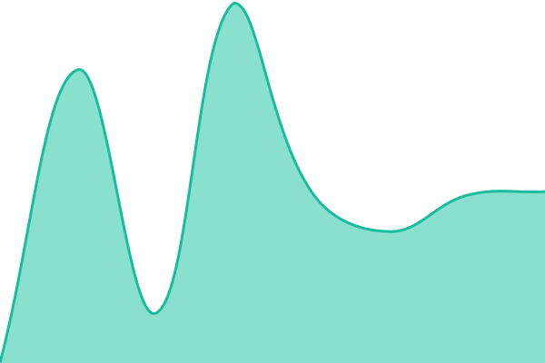
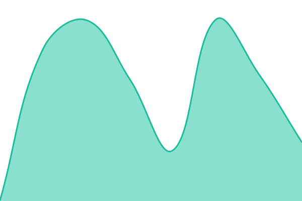
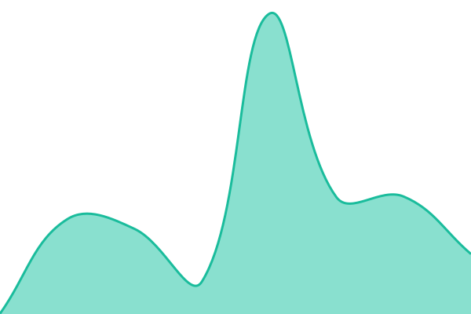
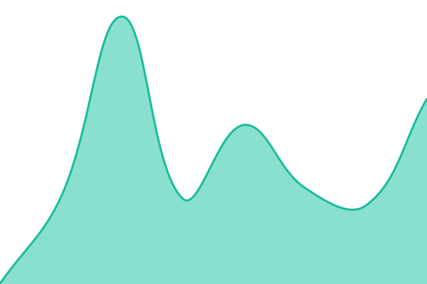
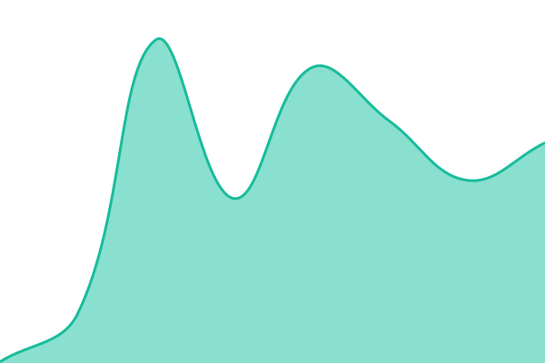
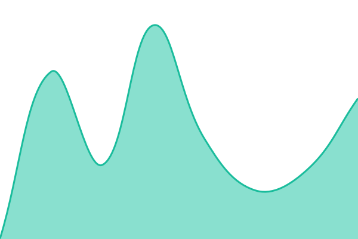
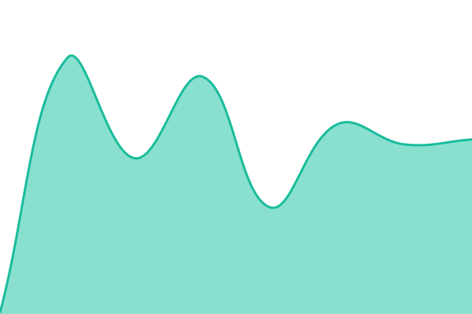
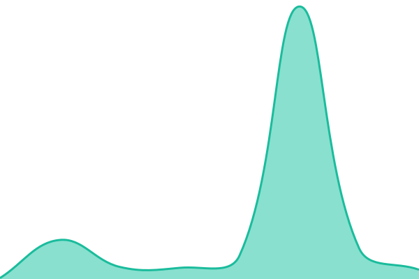
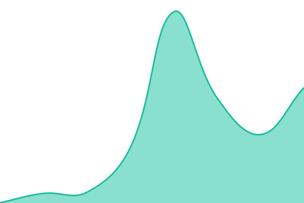

# [📈 Live Status](https://status.cristianobleve.com): <!--live status--> **🟧 Partial outage**

This repository contains the open-source uptime monitor and status page for [Cristiano Bleve](https://cristianobleve.com), powered by [Upptime](https://github.com/upptime/upptime).

With [Upptime](https://upptime.js.org), you can get your own unlimited and free uptime monitor and status page, powered entirely by a GitHub repository. We use [Issues](https://github.com/cristianobleve/status/issues) as incident reports, [Actions](https://github.com/cristianobleve/status/actions) as uptime monitors, and [Pages](https://status.cristianobleve.com) for the status page.

<!--start: status pages-->
<!-- This summary is generated by Upptime (https://github.com/upptime/upptime) -->
<!-- Do not edit this manually, your changes will be overwritten -->
<!-- prettier-ignore -->
| URL | Status | History | Response Time | Uptime |
| --- | ------ | ------- | ------------- | ------ |
|  [Main Website](https://cristianobleve.com) | 🟩 Up | [main-website.yml](https://github.com/cristianobleve/status/commits/HEAD/history/main-website.yml) | 

 895ms
     
 | 

<a href="https://status.cristianobleve.com/history/main-website">100.00%</a>
    

|  [Portfolio (Main)](https://portfolio.cristianobleve.com) | 🟩 Up | [portfolio-main.yml](https://github.com/cristianobleve/status/commits/HEAD/history/portfolio-main.yml) | 

 1134ms
     
 | 

<a href="https://status.cristianobleve.com/history/portfolio-main">100.00%</a>
    

|  [Portfolio (Alt)](https://port.cristianobleve.com) | 🟩 Up | [portfolio-alt.yml](https://github.com/cristianobleve/status/commits/HEAD/history/portfolio-alt.yml) | 

 780ms
     
 | 

<a href="https://status.cristianobleve.com/history/portfolio-alt">100.00%</a>
    

|  [Shortener Service](https://go.cristianobleve.com) | 🟩 Up | [shortener-service.yml](https://github.com/cristianobleve/status/commits/HEAD/history/shortener-service.yml) | 

 455ms
     
 | 

<a href="https://status.cristianobleve.com/history/shortener-service">4.00%</a>
    

|  [Login Portal](https://login.cristianobleve.com) | 🟩 Up | [login-portal.yml](https://github.com/cristianobleve/status/commits/HEAD/history/login-portal.yml) | 

 1140ms
     
 | 

<a href="https://status.cristianobleve.com/history/login-portal">100.00%</a>
    

|  [Mail Service](https://mail.cristianobleve.com) | 🟩 Up | [mail-service.yml](https://github.com/cristianobleve/status/commits/HEAD/history/mail-service.yml) | 

 363ms
     
 | 

<a href="https://status.cristianobleve.com/history/mail-service">100.00%</a>
    

|  [Meet App](https://meet.cristianobleve.com) | 🟩 Up | [meet-app.yml](https://github.com/cristianobleve/status/commits/HEAD/history/meet-app.yml) | 

 373ms
     
 | 

<a href="https://status.cristianobleve.com/history/meet-app">100.00%</a>
    

|  [Map Application](https://map.cristianobleve.com) | 🟩 Up | [map-application.yml](https://github.com/cristianobleve/status/commits/HEAD/history/map-application.yml) | 

 1364ms
     
 | 

<a href="https://status.cristianobleve.com/history/map-application">100.00%</a>
    

|  [Tools Platform](https://tools.cristianobleve.com) | 🟩 Up | [tools-platform.yml](https://github.com/cristianobleve/status/commits/HEAD/history/tools-platform.yml) | 

 302ms
     
 | 

<a href="https://status.cristianobleve.com/history/tools-platform">100.00%</a>
    

|  [Solar App](https://solar.cristianobleve.com) | 🟩 Up | [solar-app.yml](https://github.com/cristianobleve/status/commits/HEAD/history/solar-app.yml) | 

 310ms
     
 | 

<a href="https://status.cristianobleve.com/history/solar-app">100.00%</a>
    

|  [QR Extension](https://qrext.cristianobleve.com) | 🟩 Up | [qr-extension.yml](https://github.com/cristianobleve/status/commits/HEAD/history/qr-extension.yml) | 

 266ms
     
 | 

<a href="https://status.cristianobleve.com/history/qr-extension">100.00%</a>
    

|  [Tracking DS](https://trackingds.cristianobleve.com) | 🟥 Down | [tracking-ds.yml](https://github.com/cristianobleve/status/commits/HEAD/history/tracking-ds.yml) | 

 117ms
     
 | 

<a href="https://status.cristianobleve.com/history/tracking-ds">0.00%</a>
    

|  [Background Remover](https://bgremover.cristianobleve.com) | 🟩 Up | [background-remover.yml](https://github.com/cristianobleve/status/commits/HEAD/history/background-remover.yml) | 

 310ms
     
 | 

<a href="https://status.cristianobleve.com/history/background-remover">100.00%</a>
    

|  [Carrubo Platform](https://carrubo.cristianobleve.com) | 🟩 Up | [carrubo-platform.yml](https://github.com/cristianobleve/status/commits/HEAD/history/carrubo-platform.yml) | 

 327ms
     
 | 

<a href="https://status.cristianobleve.com/history/carrubo-platform">100.00%</a>
    

|  [Carrubo Docs](https://docs.carrubo.cristianobleve.com) | 🟩 Up | [carrubo-docs.yml](https://github.com/cristianobleve/status/commits/HEAD/history/carrubo-docs.yml) | 

 324ms
     
 | 

<a href="https://status.cristianobleve.com/history/carrubo-docs">100.00%</a>
    

|  [Dev Car](https://dev-car.cristianobleve.com) | 🟩 Up | [dev-car.yml](https://github.com/cristianobleve/status/commits/HEAD/history/dev-car.yml) | 

 328ms
     
 | 

<a href="https://status.cristianobleve.com/history/dev-car">100.00%</a>
    

|  [Films](https://films.cristianobleve.com) | 🟩 Up | [films.yml](https://github.com/cristianobleve/status/commits/HEAD/history/films.yml) | 

 361ms
     
 | 

<a href="https://status.cristianobleve.com/history/films">100.00%</a>
    

|  [Static CDN](https://cdn.cristianobleve.com) | 🟩 Up | [static-cdn.yml](https://github.com/cristianobleve/status/commits/HEAD/history/static-cdn.yml) | 

 204ms
     
 | 

<a href="https://status.cristianobleve.com/history/static-cdn">100.00%</a>
    

|  [Images CDN](https://image.cristianobleve.com) | 🟥 Down | [images-cdn.yml](https://github.com/cristianobleve/status/commits/HEAD/history/images-cdn.yml) | 

 0ms
     
 | 

<a href="https://status.cristianobleve.com/history/images-cdn">0.00%</a>
    

|  [Img Service](https://img.cristianobleve.com) | 🟩 Up | [img-service.yml](https://github.com/cristianobleve/status/commits/HEAD/history/img-service.yml) | 

 1185ms
     
 | 

<a href="https://status.cristianobleve.com/history/img-service">100.00%</a>
    

|  [Web Fonts](https://fonts.cristianobleve.com) | 🟥 Down | [web-fonts.yml](https://github.com/cristianobleve/status/commits/HEAD/history/web-fonts.yml) | 

 30ms
     
 | 

<a href="https://status.cristianobleve.com/history/web-fonts">0.00%</a>
    

|  [Unlock Service](https://unlock.cristianobleve.com) | 🟥 Down | [unlock-service.yml](https://github.com/cristianobleve/status/commits/HEAD/history/unlock-service.yml) | 

 0ms
     
 | 

<a href="https://status.cristianobleve.com/history/unlock-service">0.00%</a>
    

|  [n8n Automation](https://n8n.cristianobleve.com) | 🟥 Down | [n8n-automation.yml](https://github.com/cristianobleve/status/commits/HEAD/history/n8n-automation.yml) | 

 56ms
     
 | 

<a href="https://status.cristianobleve.com/history/n8n-automation">0.00%</a>
    

|  [D&D Project](https://dndproject.cristianobleve.com) | 🟥 Down | [d-and-d-project.yml](https://github.com/cristianobleve/status/commits/HEAD/history/d-and-d-project.yml) | 

 55ms
     
 | 

<a href="https://status.cristianobleve.com/history/d-and-d-project">0.00%</a>
    

|  [CL Car Tunnel](https://clcar.cristianobleve.com) | 🟥 Down | [cl-car-tunnel.yml](https://github.com/cristianobleve/status/commits/HEAD/history/cl-car-tunnel.yml) | 

 0ms
     
 | 

<a href="https://status.cristianobleve.com/history/cl-car-tunnel">0.00%</a>
    

|  [Mesh Network](https://mesh.cristianobleve.com) | 🟥 Down | [mesh-network.yml](https://github.com/cristianobleve/status/commits/HEAD/history/mesh-network.yml) | 

 49ms
     
 | 

<a href="https://status.cristianobleve.com/history/mesh-network">0.00%</a>
    

|  [App Service Tunnel](https://app.tuodominio.it.cristianobleve.com) | 🟥 Down | [app-service-tunnel.yml](https://github.com/cristianobleve/status/commits/HEAD/history/app-service-tunnel.yml) | 

 0ms
     
 | 

<a href="https://status.cristianobleve.com/history/app-service-tunnel">0.00%</a>
    

|  [Minecraft Web Interface](https://mc.cristianobleve.com) | 🟥 Down | [minecraft-web-interface.yml](https://github.com/cristianobleve/status/commits/HEAD/history/minecraft-web-interface.yml) | 

 72ms
     
 | 

<a href="https://status.cristianobleve.com/history/minecraft-web-interface">0.00%</a>
    

|  [Minecraft Cobble Server](https://mcobble.cristianobleve.com) | 🟥 Down | [minecraft-cobble-server.yml](https://github.com/cristianobleve/status/commits/HEAD/history/minecraft-cobble-server.yml) | 

 53ms
     
 | 

<a href="https://status.cristianobleve.com/history/minecraft-cobble-server">0.00%</a>
    

<!--end: status pages-->

[**Visit our status website →**](https://status.cristianobleve.com)

## 📄 License

- Powered by: [Upptime](https://github.com/upptime/upptime)
- Code: [MIT](./LICENSE) © [Anand Chowdhary](https://anandchowdhary.com)
- Data in the `./history` directory: [Open Database License](https://opendatacommons.org/licenses/odbl/1-0/)
